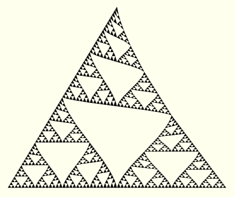

# Rekursion
Ein [Sierpinski-Dreieck](https://de.wikipedia.org/wiki/Sierpinski-Dreieck) ist ein Fraktal, welches mit unterschiedlicher Tiefe gezeichnet werden kann.
Folgende Animation zeigt wie sich das Fraktal ändert, wenn die Tiefe erhöht wird:

</img>

Sierpinski-Dreieck Animation

Schreiben Sie eine Funktion, die ein solches Sierpinski-Dreieck zeichnet.

    function drawSierpinski(x0, y0, x1, y1, x2, y2, depth=6)
    
Die ersten 6 Parameter stellen dabei die drei Eckpunkte des Dreiecks dar: _p0 = (x0, y0), p1 = (x1, y1), p2 = (x2, y2)_
Der letzte Parameter beschreibt, wie tief das Fraktal noch gehen soll.

Bei `depth=0` soll ein solides Dreieck gezeichnet werden. Bei `depth=1` soll an jeder Ecke ein kleineres Dreieck gezeichnet werden, welche sich an den Mittelpunkten der Seitenlinien berühren.

Die Funktion soll sich selbst mit den Koordinaten eines kleineren Dreiecks aufrufen.

Nutzen Sie folgenden Code um die Funktion zu Testen.

	var cw = canvas.width(), ch = canvas.height();
	drawSierpinski(0.5*cw, 0.2*ch, 
	               0.1*cw, 0.8*ch,
	               0.9*cw, 0.8*ch,
	               depth=6);

---
## Tipps

<b>Tipp 0: Abbruchbedingung</b>

Überlegen Sie bei welcher Bedingung sich die Funktion nicht weiter selbst aufruft.

<i>Lösung</i>

`depth == 0` oder `depth < 1` oder ähnliches

<b>Tipp 1: Rekursionsanfang</b>

Überlegen Sie sich, was getan werden soll, wenn die Abbruchbedingung erfüllt ist.

<i>Hinweis</i>

Denken Sie dran, was oben bei `depth=0` erwähnt worden ist.

<i>Lösung</i>

Füllen des kompletten Dreiecks.

<b>Tipp 2: Zeichnen eines Dreiecks</b>

Die Funktion `canvas.fillArea` zeichnet ein Polygon. Die Funktion übernimmt als einzigen Parameter ein Array mit beliebiger Länge.
Jedes Element ist wiederum ein Array, welches 2 Elemente besitzt: eine `x` und eine `y` Koordinate. Dies sind jeweils die Eckpunkte des Polygons.

<i>Lösung</i>

	canvas.fillArea([[x0, y0], [x1, y1], [x2, y2]]);

<b>Tipp 3: Rekursionsschritt</b>

Überlegen Sie wie oft sich die Funktion direkt selbst aufruft.

<i>Lösung</i>

Drei mal für alle drei Ecken

<b>Tipp 4: Zerlegung des Dreiecks</b>

Überlegen Sie sich, wie die Eckpunkte der kleineren Dreiecke an den Ecken berechnet werden.

<i>Hinweis 0</i>

Ein Eckpunkt ist gleichzeitig immer ein Eckpunkt des größeren Dreiecks.

<i>Hinweis 1</i>

Die beiden anderen Eckpunkte sind die Mittelpunkte der Strecken zwischen diesem Punkt und jeweils einem der beiden anderen Punkte.
(Berechnung: Siehe Tipp 5)

<b>Tipp 5: Mittelpunkt bestimmen</b>

Überlegen Sie, wie man den Mittelwert von zwei Zahlen bestimmt.

<i>Hinweis</i>

Berechnen Sie jeweils den Mittelwert der beiden `x` Koordinaten und den Mittelwert der beiden `y` Koordinaten.

<i>Lösung</i>

Mögliche Lösungen sind
* `(x0+x1)/2`, `(y0+y1)/2`
* `x0 + (x1-x0)/2`, `y0 + (y1-y0)/2`
* `0.5*x0 + 0.5*x1`, `0.5*y0 + 0.5*y1`

Schreiben Sie die Koordinaten der Mittelpunkte in Variablen, denn Sie werden diese mehrmals gebrauchen.
Sie werden jeden dieser Werte zwei mal nutzen, denn ein Dreieck berührt ein anderes Dreieck in diesem Punkt.

---

## Musterlösung

<b>Lösung 0</b>

    function drawSierpinski(x0, y0, x1, y1, x2, y2, depth=6)
	{
		if depth <= 0 then
		{
			canvas.fillArea([[x0, y0], [x1, y1], [x2, y2]]);
		}
		else
		{
			var x01	= (x0+x1)/2, y01 = (y0+y1)/2; # Mittelpunkt zwischen p0 und p1
			var x02	= (x0+x2)/2, y02 = (y0+y2)/2; # Mittelpunkt zwischen p0 und p2
			var x12	= (x1+x2)/2, y12 = (y1+y2)/2; # Mittelpunkt zwischen p1 und p2
			
			drawSierpinski(x0, y0, x01, y01, x02, y02, depth-1);
			drawSierpinski(x1, y1, x01, y01, x12, y12, depth-1);
			drawSierpinski(x2, y2, x02, y02, x12, y12, depth-1);
		}
	}
	

<b>Lösung 1</b>

	function mix(z, a, b)
	{
		# Äquivalent zu a*(1-z) + b*z
		return a + (b-a)*z;
	}

	function drawSierpinski(x0, y0, x1, y1, x2, y2, depth=6)
	{
		if depth <= 0 then
		{
			canvas.fillArea([[x0, y0], [x1, y1], [x2, y2]]);
		}
		else
		{
			var x01	= mix(0.5, x0, x1), y01 = mix(0.5, y0, y1); # Mittelpunkt zwischen p0 und p1
			var x02	= mix(0.5, x0, x2), y02 = mix(0.5, y0, y2); # Mittelpunkt zwischen p0 und p2
			var x12	= mix(0.5, x1, x2), y12 = mix(0.5, y1, y2); # Mittelpunkt zwischen p1 und p2
			
			drawSierpinski(x0, y0, x01, y01, x02, y02, depth-1);
			drawSierpinski(x1, y1, x01, y01, x12, y12, depth-1);
			drawSierpinski(x2, y2, x02, y02, x12, y12, depth-1);
		}
	}
	
Probieren Sie einzelne `0.5` mit anderen Werten Zu ersetzen.

<i>Beispiel</i>

Ersetzt man `y02 = mix(0.5, y0, y2)` mit `y02 = mix(0.6, y0, y2)` entsteht ein unvollkommenes Sierpinski-Dreieck,
welches ein bisschen gekrümmt ist.

Verändertes Sierpinski-Dreieck

	

<b>Gesamtes Programm</b>

	
	function drawSierpinski(x0, y0, x1, y1, x2, y2, depth=6)
	{
		if depth <= 0 then
		{
			canvas.fillArea([[x0, y0], [x1, y1], [x2, y2]]);
		}
		else
		{
			var x01	= (x0+x1)/2, y01 = (y0+y1)/2; # Mittelpunkt zwischen p0 und p1
			var x02	= (x0+x2)/2, y02 = (y0+y2)/2; # Mittelpunkt zwischen p0 und p2
			var x12	= (x1+x2)/2, y12 = (y1+y2)/2; # Mittelpunkt zwischen p1 und p2

			drawSierpinski(x0, y0, x01, y01, x02, y02, depth-1);
			drawSierpinski(x1, y1, x01, y01, x12, y12, depth-1);
			drawSierpinski(x2, y2, x02, y02, x12, y12, depth-1);
		}
	}

	var cw = canvas.width(), ch = canvas.height();
	for var i in 0:10 do
	{
		canvas.setFillColor(1, 1, 1);
		canvas.clear();

		canvas.setFillColor(0, 0, 0);
		drawSierpinski(0.5*cw, 0.2*ch, 
					   0.1*cw, 0.8*ch,
					   0.9*cw, 0.8*ch,
					   depth=i);

		wait(700);
	}

## Schrittweise Implementierung

<b>Schritt 0: Leerer Funktionskörper</b>

	function drawSierpinski(x0, y0, x1, y1, x2, y2, depth=6)
	{
	
	}

<b>Schritt 1: Abbruchbedingung</b>

	function drawSierpinski(x0, y0, x1, y1, x2, y2, depth=6)
	{
		if depth <= 0 then
		{
		
		}
		else
		{
		
		}
	}

<b>Schritt 2: Rekursionsanfang</b>

	function drawSierpinski(x0, y0, x1, y1, x2, y2, depth=6)
	{
		if depth <= 0 then
		{
			canvas.fillArea([[x0, y0], [x1, y1], [x2, y2]]);
		}
		else
		{
		
		}
	}

<b>Schritt 3: Mittelpunkte bestimmen</b>

	function drawSierpinski(x0, y0, x1, y1, x2, y2, depth=6)
	{
		if depth <= 0 then
		{
			canvas.fillArea([[x0, y0], [x1, y1], [x2, y2]]);
		}
		else
		{
			var x01	= (x0+x1)/2, y01 = (y0+y1)/2; # Mittelpunkt zwischen p0 und p1
			var x02	= (x0+x2)/2, y02 = (y0+y2)/2; # Mittelpunkt zwischen p0 und p2
			var x12	= (x1+x2)/2, y12 = (y1+y2)/2; # Mittelpunkt zwischen p1 und p2
		}
	}

<b>Schritt 4: Rekursionsschritt</b>

	function drawSierpinski(x0, y0, x1, y1, x2, y2, depth=6)
	{
		if depth <= 0 then
		{
			canvas.fillArea([[x0, y0], [x1, y1], [x2, y2]]);
		}
		else
		{
			var x01	= (x0+x1)/2, y01 = (y0+y1)/2; # Mittelpunkt zwischen p0 und p1
			var x02	= (x0+x2)/2, y02 = (y0+y2)/2; # Mittelpunkt zwischen p0 und p2
			var x12	= (x1+x2)/2, y12 = (y1+y2)/2; # Mittelpunkt zwischen p1 und p2
			
			drawSierpinski(x0, y0, x01, y01, x02, y02, depth-1);
			drawSierpinski(x1, y1, x01, y01, x12, y12, depth-1);
			drawSierpinski(x2, y2, x02, y02, x12, y12, depth-1);
		}
	}

